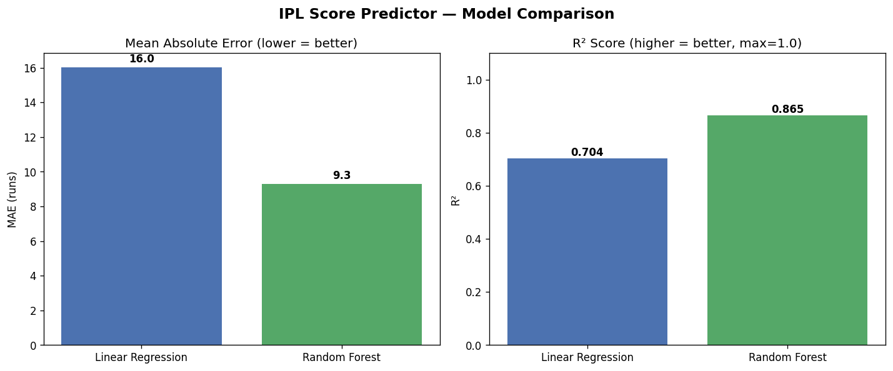
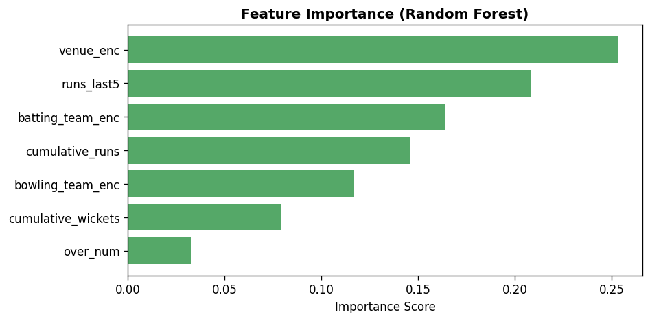
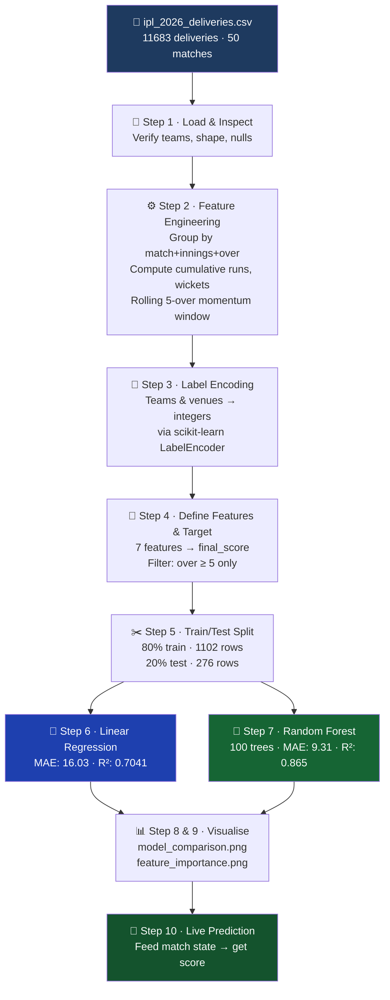

<div align="center">


<br/>

**A machine learning system that predicts IPL T20 innings totals in real-time,**  
**using live match context — overs bowled, runs scored, wickets fallen, and recent momentum.**

<br/>

[](https://python.org)
[](https://scikit-learn.org)
[](https://pandas.pydata.org)
[](https://matplotlib.org)
[](LICENSE)
[](https://ipl.com)

<br/>

```
🏆 Random Forest  →  MAE: 9.31 runs  |  R²: 0.865  |  Trained on 50 matches, 11,683 deliveries
```

</div>

---

## ✨ Key Highlights

<table>
<tr>
<td align="center" width="25%">
<h3>📦 Dataset</h3>
<b>11,683</b> deliveries<br/>
<b>50</b> IPL 2026 matches<br/>
<b>10</b> teams · <b>11</b> venues
</td>
<td align="center" width="25%">
<h3>🎯 Best Model</h3>
Random Forest<br/>
<b>MAE: ±9.3 runs</b><br/>
<b>R²: 0.865</b>
</td>
<td align="center" width="25%">
<h3>⚡ Features</h3>
<b>7</b> engineered features<br/>
Real-time match state<br/>
Rolling 5-over momentum
</td>
<td align="center" width="25%">
<h3>🔬 Models</h3>
Linear Regression<br/>
Random Forest<br/>
Side-by-side benchmarking
</td>
</tr>
</table>

---

## 📊 Results at a Glance

<div align="center">

| | Model | Mean Absolute Error ↓ | R² Score ↑ | Verdict |
|---|---|---|---|---|
| 🔵 | Linear Regression | 16.03 runs | 0.7041 | Good baseline |
| 🌲 | **Random Forest** | **9.31 runs** | **0.8650** | ✅ **Best model** |

> **Random Forest is 42% more accurate on MAE** and explains **86.5% of score variance**

</div>

<br/>

| Model Comparison | Feature Importance |
|:---:|:---:|
|  |  |
| *MAE & R² across both models* | *Which features drive predictions most* |

---

## 🎯 Live Prediction Example

> **Scenario:** MI batting vs GT at Narendra Modi Stadium, Ahmedabad — Over 15, 122/4, 47 runs in last 5 overs

```python
# Input match state
sample = {
    'batting_team':       'MI',
    'bowling_team':       'GT',
    'venue':              'Narendra Modi Stadium, Ahmedabad',
    'over_num':           15,
    'cumulative_runs':    122,
    'cumulative_wickets': 4,
    'runs_last5':         47
}

# Predicted final scores
# ├── 🔵 Linear Regression  →  166 runs
# └── 🌲 Random Forest      →  194 runs  ✅
```

---

## 🔬 ML Pipeline



---

## 🧠 Features Explained

| # | Feature | Type | What It Captures |
|---|---------|------|-----------------|
| 1 | `batting_team_enc` | Categorical | Team batting strength & style |
| 2 | `bowling_team_enc` | Categorical | Bowling attack quality |
| 3 | `venue_enc` | Categorical | Ground dimensions & pitch characteristics |
| 4 | `over_num` | Numeric | Innings stage — powerplay vs. death overs |
| 5 | `cumulative_runs` | Numeric | **#1 predictor** — score trajectory so far |
| 6 | `cumulative_wickets` | Numeric | Batting resources remaining |
| 7 | `runs_last5` | Numeric | Scoring momentum of last 5 overs |

> 🎯 **Target:** `final_score` — the innings total. Predictions only made from **over 5 onwards** to ensure enough context.

---

## 📂 Project Structure

```
score-predictor/
│
├── 🐍  model.py                   ← Full 10-step ML pipeline
├── 📊  ipl_2026_deliveries.csv    ← Ball-by-ball dataset (11,683 rows)
├── 📈  model_comparison.png       ← MAE & R² bar chart
├── 🌿  feature_importance.png     ← Random Forest feature rankings
├── 📋  output.txt                 ← Latest console run output
└── 📖  README.md                  ← You are here
```

---

## 📦 Dataset Details

| Property | Value |
|----------|-------|
| **Season** | IPL 2026 |
| **Phase** | Group Stage |
| **Date Range** | Mar 28 – May 7, 2026 |
| **Total Deliveries** | 11,683 |
| **Total Matches** | 50 |
| **Teams** | CSK · DC · GT · KKR · LSG · MI · PBKS · RCB · RR · SRH |
| **Venues** | 11 stadiums across India |
| **Training Samples** | 1,378 over-level snapshots |
| **Train / Test Split** | 1,102 / 276 rows (80/20) |

<details>
<summary>🏟️ <b>View all 11 venues</b></summary>

<br/>

| Stadium | City |
|---------|------|
| M.Chinnaswamy Stadium | Bengaluru |
| MA Chidambaram Stadium | Chennai |
| Arun Jaitley Stadium | Delhi |
| Eden Gardens | Kolkata |
| Wankhede Stadium | Mumbai |
| Narendra Modi Stadium | Ahmedabad |
| Rajiv Gandhi International Stadium | Hyderabad |
| Sawai Mansingh Stadium | Jaipur |
| Barsapara Cricket Stadium | Guwahati |
| Ekana Cricket Stadium | Lucknow |
| Maharaja Yadavindra Singh International Cricket Stadium | Mullanpur |

</details>

---

## 🚀 Getting Started

### 1 · Clone the repo

```bash
git clone https://github.com/thunder-11/score-predictor.git
cd score-predictor
```

### 2 · Install dependencies

```bash
pip install pandas numpy scikit-learn matplotlib
```

### 3 · Run the full pipeline

```bash
python model.py
```

<details>
<summary>📋 <b>What happens when you run it?</b></summary>

```
✅  Loads 11,683 ball-by-ball deliveries from CSV
✅  Engineers per-over features (cumulative stats + momentum)
✅  Label-encodes teams and venues
✅  Trains Linear Regression  →  MAE: 16.03 · R²: 0.7041
✅  Trains Random Forest      →  MAE:  9.31 · R²: 0.8650
✅  Saves model_comparison.png and feature_importance.png
✅  Runs a live score prediction for a sample match state
```

</details>

---

## 🔧 Predict Any Match State

Simply edit the `sample` dict near the bottom of `model.py`:

```python
sample = {
    'batting_team':       'RCB',                           # any of the 10 teams
    'bowling_team':       'CSK',
    'venue':              'M.Chinnaswamy Stadium, Bengaluru',
    'over_num':           12,                              # overs 5–20
    'cumulative_runs':    98,                              # runs so far
    'cumulative_wickets': 3,                               # wickets fallen
    'runs_last5':         42,                              # last 5 overs runs
}
```

---

## 🌲 Why Random Forest Outperforms Linear Regression

Cricket is **inherently non-linear**:

- A cluster of wickets mid-innings can collapse a score by 30+ runs
- Death-over hitting (overs 17–20) can add 60+ runs in a blink
- Venue and team matchup effects are non-additive

**Linear Regression** assumes all relationships are straight lines — a major handicap for cricket data.

**Random Forest** grows 100 independent decision trees, each learning different non-linear split patterns, then averages their predictions. This ensemble approach naturally handles the spiky, context-dependent nature of T20 scoring.

| Metric | Linear Regression | Random Forest | Δ Improvement |
|--------|:-----------------:|:-------------:|:---:|
| MAE (runs) | 16.03 | **9.31** | **−42%** ✅ |
| R² Score | 0.7041 | **0.8650** | **+23%** ✅ |

---

## 🛠️ Tech Stack

| Library | Version | Role |
|---------|---------|------|
| **Python** | 3.8+ | Core language |
| **Pandas** | 2.x | Data wrangling, groupby, rolling windows |
| **NumPy** | 1.x | Array operations |
| **scikit-learn** | 1.x | Models, LabelEncoder, train_test_split, metrics |
| **Matplotlib** | 3.x | Bar charts, feature importance plots |

---

## 🔮 Roadmap

- [ ] 🚀 **XGBoost / LightGBM** — gradient boosting for even higher accuracy
- [ ] 🧬 **Player-level features** — striker strike rate, bowler economy in this innings
- [ ] 🌦️ **Contextual features** — toss result, day/night, pitch report
- [ ] 🌐 **Streamlit web app** — interactive real-time score predictor
- [ ] 📡 **REST API** — plug into live match dashboards
- [ ] 📅 **Multi-season data** — extend to IPL 2020–2026 for robustness
- [ ] 🏆 **Playoffs coverage** — include Qualifier & Final matches

---

## 🤝 Contributing

All contributions are welcome — from bug fixes to new model ideas!

```bash
# 1. Fork this repository
# 2. Create your feature branch
git checkout -b feature/add-xgboost

# 3. Make your changes and commit
git commit -m "feat: add XGBoost regressor with hyperparameter tuning"

# 4. Push and open a Pull Request
git push origin feature/add-xgboost
```

---

## 📄 License

Distributed under the **MIT License**. See [`LICENSE`](LICENSE) for details.

---

<div align="center">

<br/>

**Built with ❤️, Python, and a deep love for cricket**

<br/>

*Found this useful? Drop a ⭐ — it keeps the stumps standing!*

<br/>

[](https://github.com/thunder-11/score-predictor)

</div>
